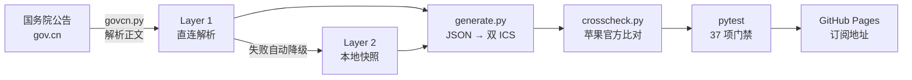

# RedDays

中国法定节假日的苹果日历订阅源，直连国务院公告解析，每日自动发布。日历里只有红日子（法定假日和调休补班），没有节气、农历和普通周末的噪音。

**数据来源：[国务院办公厅放假通知](https://www.gov.cn/zhengce/)（国办发明电），CI 每日两次自动抓取解析。**

**订阅地址**：

- 逐日详细版：`https://ygnstudio.github.io/RedDays/reddays-detailed.ics`
- 极简版：`https://ygnstudio.github.io/RedDays/reddays-minimal.ics`

## 日历长什么样

**标题**（月视图一眼可读）：

```
春节 假 2/9        ← 假期第 2 天，共 9 天
春节 补 1/2        ← 为春节补班，共 2 天中的第 1 天
国庆节 补 2/2      ← 10/10，本次假期最后一个补班日
```

**描述**（点开事件看全上下文）：

```
「春节」假期第2天（共9天）
假期：2月15日至2月23日
调休补班：2月14日、2月28日
下一个假期：清明节（4月4日至4月6日）
依据国务院办公厅通知: https://www.gov.cn/...
```

补班事件描述含：为哪个假期调休（范围+天数）、共补几天与日期清单、此为第几天、下一次补班是哪天（跨年自动带年份）、公告原文链接。

## 两个版本怎么选

| 版本 | 内容 | 适合 |
|---|---|---|
| **详细版** | 假期每天一条（`春节 假 2/9`），补班带 09:00-18:00 时间与前一晚 21:00 提醒 | 临近假期看进度、补班闹钟 |
| **极简版** | 仅假期首日（`春节（休）`）与补班日（`春节（班）`），全年约 13 条 | 平时保持日历干净 |

建议两个都订，平时只开极简版，放假前打开详细版。

**添加方式**：macOS「日历 → 文件 → 新建日历订阅（⌥⌘S）」粘贴链接；或把 `https://` 换成 `webcal://` 直接点开。

## 工作原理



每日北京 07:30 和 19:30 各跑一次；任何一步失败就不发布，并发邮件告警。

## 设计约定

- 解析失效时用本地快照继续发布，照常出旧数据并自动开 issue；唯一能让 CI 失败的是数据超 400 天没更新，断更必须以失败的形式露出来
- 发布前数据和苹果官方日历做交叉校验（补班日集合必须一致），37 项测试全绿才上线；数据变了而日历没变说明生成器坏了，直接 fail
- 新年份必须人工确认。首次解析的年份没有历年真值，苹果日历也还没覆盖，是整条流水线唯一没有自动兜底的环节：这类数据会被扣下不发布，issue 里附逐条摘要，核对公告原文后把年份加进 `data/approved.txt` 放行。小模型自动校验试过并放弃了，Qwen3-1.7B 和 4B 对 20 年公告回测都不可靠，所以不靠模型
- 事件身份由「日期+类型+版本」派生，内容更新时苹果日历原地刷新，不会重复插入
- 事件命名、补班上下班时间、提醒、颜色、描述开关全在 [`config.py`](./config.py)，改长相不动逻辑
- `generate.py` 纯标准库实现 RFC 5545（折行/转义），只有 gov.cn 解析层用 requests + bs4

## 常见问题

- **为什么没有普通周末？** 「与周末连休」的周末不是法定节假日，国务院数据不含，本日历照实呈现（依据[《全国年节及纪念日放假办法》](https://www.gov.cn/zhengce/content/202411/content_6986380.htm)）
- **明年怎么是空的？** 次年安排以国务院公告为准（历年 10 月下旬到 12 月上旬发布），发布后最坏约 12 小时内自动解析并开 issue 待确认；核对无误把年份加入 `data/approved.txt` 推送即自动上线
- **改了订阅手机没变？** iOS 订阅刷新由系统调度（数小时到一天）；Mac 可右键日历 → 刷新。UID 稳定，删除重加不会重复

## 目录结构

```
RedDays/
├── config.py                  # 全部展示偏好（唯一需要改的文件）
├── data/                      # 历年数据（2007 起，JSON，含公告出处）
│   └── {year}.json            #   days[].{name,date,isOffDay} + papers[]
├── schema.json                # 数据 JSON Schema
├── scripts/
│   ├── sync.py                # 数据同步：直连解析 + 快照降级 + 双重守卫
│   ├── govcn.py               # gov.cn 公告发现、下载与解析（原生实现）
│   ├── generate.py            # JSON → 双版本 ICS（纯标准库）
│   ├── crosscheck.py          # 苹果官方日历交叉校验（发布门禁）
│   └── paths.py               # 仓库路径工具
├── tests/                     # 离线测试（含解析器句式用例与守卫），network 标记的端到端真值对照默认跳过
├── docs/ARCHITECTURE.md       # 架构与运维手册
└── .github/workflows/
    └── publish.yml            # 每日 07:30/19:30 发布全链路
```

## JSON 数据

除 ICS 外提供规范化 JSON，适合程序读取：

```
https://raw.githubusercontent.com/ygnstudio/RedDays/master/data/{年份}.json
```

Schema 见 [schema.json](./schema.json)，`papers[]` 字段为对应国务院文件 URL，覆盖 2007 年至今全部历史安排。

## 本地开发

```bash
pip install -r dev-requirements.txt
python scripts/sync.py            # 同步数据（直连解析，失败落快照）+ 双重守卫
python scripts/generate.py        # 生成 dist/reddays-{detailed,minimal}.ics
python scripts/crosscheck.py      # 与苹果官方日历交叉校验
python -m pytest                  # 离线测试（网络测试用 -m network 单独跑）
black -t py312 .                  # 格式化
```

## 许可

- 节假日数据出自国务院公告；本仓库代码（含 `scripts/govcn.py` 解析器，经 `data/` 中 2007 至 2026 共 20 年真值全量对照验证）遵循 [MIT License](./LICENSE)
